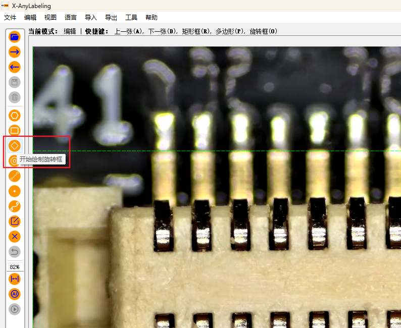
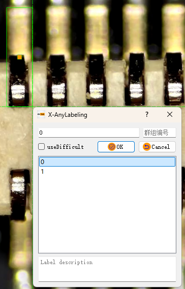
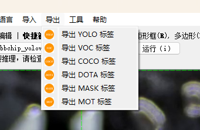
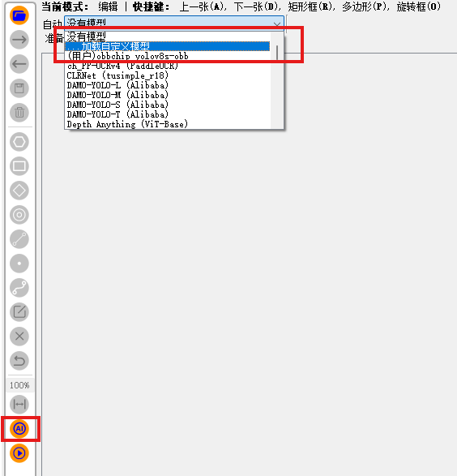

# yolov8_obb芯片引脚缺陷检测

- [yolov8_obb芯片引脚缺陷检测](#yolov8_obb芯片引脚缺陷检测)
- [1. 项目说明](#1.-项目说明)
- [2. 数据集制作](#2.-数据集制作)
- [3. 数据集转换](#3.-数据集转换)
- [安装依赖](#安装依赖)
- [4. 模型训练](#4.-模型训练)
  - [4.1 新建**dota8-obb.yaml**文件](#4.1-新建**dota8-obb.yaml**文件)
  - [4.2 新建**yolov8-obb.yaml**文件](#4.2-新建**yolov8-obb.yaml**文件)
  - [4.3 修改代码，保证动态batch](#4.3-修改代码，保证动态batch)
  - [4.4 新建**train.py**](#4.4-新建**train.py**)
  - [4.5 开始训练](#4.5-开始训练)
- [5. 模型导出](#5.-模型导出)
  - [5.1 进行辅助标注的模型导出](#5.1-进行辅助标注的模型导出)
  - [5.2 进行推理的模型导出](#5.2-进行推理的模型导出)
- [6. trt模型转换](#6.-trt模型转换)
  - [6.1 环境依赖](#6.1-环境依赖)
  - [6.2 配置CMakeLists.txt](#6.2-配置cmakelists.txt)
- [7. 推理](#7.-推理)
- [附录](#附录)
  - [1. X-AnyLabeling快捷键](#1.-x-anylabeling快捷键)
  - [2. 视频处理脚本](#2.-视频处理脚本)
  - [3. 使用自定义模型进行辅助标注](#3.-使用自定义模型进行辅助标注)
- [参考](#参考)

# 1. 项目说明

本项目实现了使用 YOLOv8-OBB 模型进行芯片引脚缺陷检测。

- 本项目不涉及具体原理等内容的说明，如果需要了解请查看本文文末的参考部分，进行进一步的学习和了解。

- 数据集制作部分建议在自己的win主机进行，本文经验也基于win的标注，其他平台请自行探索。
- 数据集转换到模型导出的过程建议使用虚拟环境，以防止对主机的环境造成影响。
- trt模型导出和推理必须在同一设备进行，trtmodel在不同平台无法通用。
- 用于辅助标注的模型[google drive](https://drive.google.com/file/d/1JqsdT-PV2CxmpiZCIqBoCm5Tzyyzg2PI/view?usp=sharing)/[baidu drive](https://pan.baidu.com/s/1qIe2CjclLvXxjpcp45Q03g?pwd=uee1)和用于推理的模型[google drive](https://drive.google.com/file/d/1JpzAzXobLKUAJt3glAjYg-YI9lNkbXE6/view?usp=sharing)/[baidu drive](https://pan.baidu.com/s/1RKT2s3M4H0WZkGHMaSNyrg?pwd=qkc1)，模型仅用于测试流程，效果不佳。

# 2. 数据集制作

数据集标注使用[X-AnyLabeling](https://github.com/CVHub520/X-AnyLabeling)进行标注，[下载链接(github release)](https://github.com/CVHub520/X-AnyLabeling/releases)。如果本地具有GPU，可以选择GPU版本，可以加速辅助标注的过程。这个软件的优点是，可以将已经训练完成的模型导入到软件中进行辅助的标注。

打开软件，打开需要标注图片的路径，或者需要标注的视频和图片。如果是图片的话建议使用脚本对图片进行处理，软件自带的处理方法会导致数据集过多，且未进行筛选。数据处理的脚本及使用方法见附录的内容。
由于是旋转模型，因此选择开始绘制旋转框，如下图所示。



在对应的位置进行标签的框选、标签名称的填写。完成绘制后选择正确的标签，点选OK即可。随后再通过**z/x/c/v**四个按键对标签框进行旋转方向的调整，调整至刚好框选完全且不多余为止。




完成标记后选择**导出**---->**导出DOTA标签**，得到提示就完成了数据集基础制作，后面还需要对格式进行转换。



# 3. 数据集转换

首先克隆yolov8-obb的git库。

```sh
git clone https://github.com/ultralytics/ultralytics.git
cd ultralytics
git checkout tags/v8.1.0 -b v8.1.0
```

升级cmake版本：

```sh
wget https://github.com/Kitware/CMake/releases/download/v3.30.0/cmake-3.30.0-linux-aarch64.tar.gz
tar -zxvf cmake-3.30.0-linux-aarch64.tar.gz
sudo mv cmake-3.30.0-linux-aarch64 /usr/local/cmake-3.30.0
sudo rm /usr/bin/cmake /usr/bin/ccmake /usr/bin/cmake-gui
sudo ln -sf /usr/local/cmake-3.30.0/bin/* /usr/bin/
cmake --version
```

输出cmake version 3.30.0即为升级成功，升级完成后安装依赖。

```sh
pip install ultralytics onnx onnxsim onnxruntime hub_sdk -i https://pypi.tuna.tsinghua.edu.cn/simple
```

在**ultralytics**中新建**dataset_obb**文件夹，建立出如图所示的目录结构，并将图片和标签放入对应的文件夹。其中train和val自行划分即可，此处不进行详细讲解。

```sh
dataset_obb
├── images
│   ├── train
│   └── val
└── labels
    ├── train_original
    └── val_original
```

得到如图所示的目录后，在**ultralytics**文件夹中新建一个脚本**convert_dota_to_yolo_obb.py**，将下面的脚本粘贴进去。

```python
from ultralytics.data.converter import convert_dota_to_yolo_obb

convert_dota_to_yolo_obb("./dataset_obb")
```

跳转至**convert_dota_to_yolo_obb**函数，对**class_mapping**进行修改，改为正确的类别数和类别名：

```python
class_mapping = {
    "plane": 0,
    "baseball-diamond": 1,
    "bridge": 2,
	...
}
```

在这个**class_mapping**函数下的**convert_label**函数结尾，有如下的片段，可以看到默认读取的图片为png，需要在这里将png修改为自己标记的图片的格式。

```python
        for image_path in TQDM(image_paths, desc=f"Processing {phase} images"):
            if image_path.suffix != ".png":
                continue
            image_name_without_ext = image_path.stem
            img = cv2.imread(str(image_path))
            h, w = img.shape[:2]
            convert_label(image_name_without_ext, w, h, orig_label_dir, save_dir)
```

修改完成后运行此脚本，在**dataset_obb/labels**下面会出现**val**和**train**的文件夹，文件夹中会有转换完成后的标签。

# 4. 模型训练

## 4.1 新建**dota8-obb.yaml**文件

   将下面的内容粘贴进去，修改文件的路径和标签数目、名称。

   ```yaml
   path: ~/ultralytics/dataset_obb # dataset root dir
   train: images/train
   val: images/val
   
   names:
     0: plane
     1: baseball-diamond
   ```

## 4.2 新建**yolov8-obb.yaml**文件

   将下面的内容粘贴进去，修改nc的数目。

   ```yaml
   # Ultralytics YOLO  , AGPL-3.0 license
   # YOLOv8 Oriented Bounding Boxes (OBB) model with P3-P5 outputs. For Usage examples see https://docs.ultralytics.com/tasks/detect
    
   # Parameters
   nc: 15  # number of classes
   scales: # model compound scaling constants, i.e. 'model=yolov8n.yaml' will call yolov8.yaml with scale 'n'
     # [depth, width, max_channels]
     n: [0.33, 0.25, 1024]  # YOLOv8n summary: 225 layers,  3157200 parameters,  3157184 gradients,   8.9 GFLOPs
     s: [0.33, 0.50, 1024]  # YOLOv8s summary: 225 layers, 11166560 parameters, 11166544 gradients,  28.8 GFLOPs
     m: [0.67, 0.75, 768]   # YOLOv8m summary: 295 layers, 25902640 parameters, 25902624 gradients,  79.3 GFLOPs
     l: [1.00, 1.00, 512]   # YOLOv8l summary: 365 layers, 43691520 parameters, 43691504 gradients, 165.7 GFLOPs
     x: [1.00, 1.25, 512]   # YOLOv8x summary: 365 layers, 68229648 parameters, 68229632 gradients, 258.5 GFLOPs
    
   # YOLOv8.0n backbone
   backbone:
     # [from, repeats, module, args]
     - [-1, 1, Conv, [64, 3, 2]]  # 0-P1/2
     - [-1, 1, Conv, [128, 3, 2]]  # 1-P2/4
     - [-1, 3, C2f, [128, True]]
     - [-1, 1, Conv, [256, 3, 2]]  # 3-P3/8
     - [-1, 6, C2f, [256, True]]
     - [-1, 1, Conv, [512, 3, 2]]  # 5-P4/16
     - [-1, 6, C2f, [512, True]]
     - [-1, 1, Conv, [1024, 3, 2]]  # 7-P5/32
     - [-1, 3, C2f, [1024, True]]
     - [-1, 1, SPPF, [1024, 5]]  # 9
    
   # YOLOv8.0n head
   head:
     - [-1, 1, nn.Upsample, [None, 2, 'nearest']]
     - [[-1, 6], 1, Concat, [1]]  # cat backbone P4
     - [-1, 3, C2f, [512]]  # 12
    
     - [-1, 1, nn.Upsample, [None, 2, 'nearest']]
     - [[-1, 4], 1, Concat, [1]]  # cat backbone P3
     - [-1, 3, C2f, [256]]  # 15 (P3/8-small)
    
     - [-1, 1, Conv, [256, 3, 2]]
     - [[-1, 12], 1, Concat, [1]]  # cat head P4
     - [-1, 3, C2f, [512]]  # 18 (P4/16-medium)
    
     - [-1, 1, Conv, [512, 3, 2]]
     - [[-1, 9], 1, Concat, [1]]  # cat head P5
     - [-1, 3, C2f, [1024]]  # 21 (P5/32-large)
    
     - [[15, 18, 21], 1, OBB, [nc, 1]]  # OBB(P3, P4, P5)
   ```

## 4.3 修改代码，保证动态batch

修改下面代码的对应位置的内容。

   ```python
   # ========== head.py ==========
   
   # ultralytics/nn/modules/head.py第241行，forward函数
   # return torch.cat([x, angle], 1) if self.export else (torch.cat([x[0], angle], 1), (x[1], angle))
   # 修改为：
   
   return torch.cat([x, angle], 1).permute(0, 2, 1) if self.export else (torch.cat([x[0], angle], 1), (x[1], angle))
   ```

## 4.4 新建**train.py**

将下面的内容粘贴进去，修改**yolov8-obb.yaml**文件名为**yolov8s-obb.yaml**（如果训练模型l则修改为yolov8l-obb.yaml，以此类推）、修改**epochs**(轮次)、**imgsz**(图像大小)、**batch**(批大小)等参数，更多参数请参考[官方网站](https://docs.ultralytics.com/usage/cfg/#predict-settings)中的**Train Settings**部分。

   ```python
   from ultralytics import YOLO
      
   # Load a model
   model = YOLO("yolov8s-obb.yaml").load("yolov8s-obb.pt")  # build from YAML and transfer weights
   
   # Train the model
   results = model.train(data="dota8-obb.yaml", epochs=100, imgsz=640, batch=4)
   ```

## 4.5 开始训练

   ```python
   python train.py
   ```

# 5. 模型导出

模型导出时需要注意，用于辅助标注的模型和用于加速推理的模型无法通用，下面会进行分别的说明。

## 5.1 进行辅助标注的模型导出

在这里建议重新克隆一份代码

```
git clone https://github.com/ultralytics/ultralytics.git ultralytics_ann
cd ultralytics_ann
```

新建一个export.py，将下面的内容粘贴进去，修改模型文件为需要转换的模型文件。

```
from ultralytics import YOLO

model = YOLO("/home/nvidia/ultralytics/runs/obb/train24/weights/best.pt")
model.export(format="onnx")
```
运行脚本，得到导出后的onnx。

```sh
python export.py
```

得到对应的onnx后，即可用于辅助标准，模型导入到标注软件的方法见附录。

## 5.2 进行推理的模型导出

后面的内容在原用于训练的项目中进行。

先根据下面的内容修改代码。

```python
# ========== exporter.py ==========

# ultralytics/engine/exporter.py第353行
# output_names = ['output0', 'output1'] if isinstance(self.model, SegmentationModel) else ['output0']
# dynamic = self.args.dynamic
# if dynamic:
#     dynamic = {'images': {0: 'batch', 2: 'height', 3: 'width'}}  # shape(1,3,640,640)
#     if isinstance(self.model, SegmentationModel):
#         dynamic['output0'] = {0: 'batch', 2: 'anchors'}  # shape(1, 116, 8400)
#         dynamic['output1'] = {0: 'batch', 2: 'mask_height', 3: 'mask_width'}  # shape(1,32,160,160)
#     elif isinstance(self.model, DetectionModel):
#         dynamic['output0'] = {0: 'batch', 2: 'anchors'}  # shape(1, 84, 8400)
# 修改为：

output_names = ['output0', 'output1'] if isinstance(self.model, SegmentationModel) else ['output']
dynamic = self.args.dynamic
if dynamic:
    dynamic = {'images': {0: 'batch'}}  # shape(1,3,640,640)
    if isinstance(self.model, SegmentationModel):
        dynamic['output0'] = {0: 'batch', 2: 'anchors'}  # shape(1, 116, 8400)
        dynamic['output1'] = {0: 'batch', 2: 'mask_height', 3: 'mask_width'}  # shape(1,32,160,160)
    elif isinstance(self.model, DetectionModel):
        dynamic['output'] = {0: 'batch'}  # shape(1, 84, 8400)
```

新建export.py，将下面内容粘贴进去，修改模型为训练的结果

```python
from ultralytics import YOLO

model = YOLO("yolov8s-obb.pt")
success = model.export(format="onnx", dynamic=True, simplify=True)
```
运行脚本，得到导出后的onnx。

```sh
python export.py
```

# 6. trt模型转换

推理过程中需要将onnx模型转换为trtmodel，以便进行加速推理。

```sh
git clone https://github.com/xjhaz/yolov8_obb_ChipPinDefectDetection.git
cd yolov8_obb_ChipPinDefectDetection
```

## 6.1 环境依赖

测试环境

- OpenCV 4.8.0
- CUDA 11.4
- cuDNN 8.6.0
- TensorRT 8.5.2
- protobuf 3.11.4

## 6.2 配置CMakeLists.txt

将compute_87、sm_87中的数字修改为自己的板卡的对应计算能力。如果使用的是其他显卡，请从[官方网站](https://developer.nvidia.com/zh-cn/cuda-gpus#compute)进行查询并进行修改。

```cmake
set(CUDA_GEN_CODE "-gencode=arch=compute_87,code=sm_87")
```

| 模块型号                                                     | 计算能力 |
| ------------------------------------------------------------ | -------- |
| [Jetson AGX Orin](https://www.nvidia.com/en-us/autonomous-machines/embedded-systems/jetson-orin/)/[Jetson Orin NX](https://www.nvidia.com/en-us/autonomous-machines/embedded-systems/jetson-orin/)/[Jetson Orin Nano](https://www.nvidia.com/en-us/autonomous-machines/embedded-systems/jetson-orin/) | 87       |
| [Jetson AGX Xavier](https://www.nvidia.com/en-us/autonomous-machines/embedded-systems/jetson-agx-xavier/)/[Jetson Xavier NX](https://www.nvidia.com/en-us/autonomous-machines/embedded-systems/jetson-xavier-nx/) | 72       |
| [Jetson TX2](https://www.nvidia.com/en-us/autonomous-machines/embedded-systems/jetson-tx2/) | 62       |
| [Jetson Nano](https://www.nvidia.com/en-us/autonomous-machines/embedded-systems/jetson-nano/) | 53       |

设置下面的路径为本机正确的路径。在Jetson平台中无需设置CUDNN_DIR，其他平台需要进行设置。

```cmake
set(OpenCV_DIR   "/usr/local/include/opencv4")
set(CUDA_TOOLKIT_ROOT_DIR   "/usr/local/cuda-11.4")
#set(CUDNN_DIR    "/usr/local/cudnn8.4.0.27-cuda11.6")
set(PROTOBUF_DIR "/usr/include/google/protobuf")
```

设置完成后进行编译

```sh
mkdir build && cd build
cmake ..
make -j
```

## 6.3 配置并转换模型

将之前生成的onnx粘贴到workspace路径下，修改config/config_convert.yaml的配置，将mode修改为转换模型的精度，model修改为模型的名字（不包含.onnx的后缀）。

```yaml
mode: "FP16"     # FP32 or FP16 or INT8
model: "best"    # Your model name
```

修改完成后进入到workspace目录进行模型的转换。转换完成后目标模型会自动存储到onnx的同目录下。

```sh
cd workspace
./pro convert
```

# 7. 推理

修改config/config_infer.yaml的配置。

| 配置项                  | 说明                                                         |
| ----------------------- | ------------------------------------------------------------ |
| source_mode             | 源模式，'1' 表示使用在 'video_path' 中指定的视频文件。'0' 表示使用'video0' 这样的视频输入设备。 |
| video                   | 视频输入设备设置，'0' 表示引用设备 '/dev/video0'。           |
| video_path              | 视频文件的路径，用于推理。                                   |
| engine_file             | TensorRT 引擎文件的路径。                                    |
| gpu_id                  | GPU 编号，'0' 表示使用第一个GPU进行处理。                    |
| confidence_threshold    | 置信度阈值，筛选出置信分数低于此值的检测结果。               |
| nms_threshold           | 非最大抑制（NMS）阈值，用于解决重叠边界框的问题。            |
| nms_method              | NMS 方法， 'FastGPU' 表示使用 GPU 加速计算， 'CPU' 表示使用 CPU 计算。 |
| max_objects             | 最大检测对象数，限制检测到的对象数量。                       |
| preprocess_multi_stream | 多流预处理标志，'false' 表示不启用多流预处理。               |

配置完成后运行

```sh
./pro 
or
./pro infer
```

成功运行之后会出现如图所示的画面，有缺陷的引脚会被标记出来。


# 附录

## 1. X-AnyLabeling快捷键

|       功能       |     快捷键     |
| :--------------: | :------------: |
|      前一张      |      A/a       |
|      后一张      |      D/d       |
|    标记旋转框    |      O/o       |
| 大角度逆时针旋转 |      Z/z       |
| 小角度逆时针旋转 |      X/x       |
| 小角度顺时针旋转 |      C/c       |
| 大角度顺时针旋转 |      V/v       |
|   删除当前标签   |    Ctrl+Del    |
|   删除当前图片   | Ctrl+Shift+Del |

## 2. 视频处理脚本

本脚本实现了将某个路径下的所有视频都转换为单张的图片。

可以设置的参数：

| 参数名               | 意义                                                         |
| -------------------- | ------------------------------------------------------------ |
| video_directory      | 输入的视频文件文件夹，后缀为mp4或avi                         |
| output_directory     | 图片的输出路径                                               |
| frame_interval       | 每隔多少帧保存为一张图片                                     |
| similarity_threshold | 相似度百分比，两次保存的图片中相似度高于此百分比则不保存新的图片 |
| max_workers          | 同时进行处理的线程数，默认为4。每个线程会处理一个视频        |

安装下列依赖：

```sh
pip install opencv-python scikit-image tqdm
```

将下面的代码复制到自己需要的路径的python文件，运行后即可得到转换后的图片文件。

```python
import os
import cv2
from skimage.metrics import structural_similarity as ssim
from concurrent.futures import ThreadPoolExecutor, as_completed
from tqdm import tqdm

def process_video(video_path, output_dir, frame_interval=10, similarity_threshold=0.95):
    capture = cv2.VideoCapture(video_path)
    video_name = os.path.splitext(os.path.basename(video_path))[0]
    frame_number = 0
    last_saved_frame = None
    while capture.isOpened():
        ret, frame = capture.read()
        if not ret:
            break
        if frame_number % frame_interval == 0:
            save_frame = True
            if last_saved_frame is not None:
                gray_frame = cv2.cvtColor(frame, cv2.COLOR_BGR2GRAY)
                gray_last_saved_frame = cv2.cvtColor(last_saved_frame, cv2.COLOR_BGR2GRAY)
                similarity = ssim(gray_frame, gray_last_saved_frame)
                if similarity > similarity_threshold:
                    save_frame = False
            if save_frame:
                frame_filename = f"{video_name}_frame_{frame_number:04d}.jpg"
                frame_path = os.path.join(output_dir, frame_filename)
                cv2.imwrite(frame_path, frame)
                last_saved_frame = frame
        frame_number += 1
    capture.release()

def extract_frames_from_videos(video_dir, output_dir, frame_interval, similarity_threshold, max_workers):
    if not os.path.exists(output_dir):
        os.makedirs(output_dir)
    video_files = [os.path.join(video_dir, filename) for filename in os.listdir(video_dir) if filename.endswith(".mp4") or filename.endswith(".avi")]
    with ThreadPoolExecutor(max_workers=max_workers) as executor:
        futures = {executor.submit(process_video, video, output_dir, frame_interval, similarity_threshold): video for video in video_files}
        for future in tqdm(as_completed(futures), total=len(futures), desc="Processing videos"):
            future.result()
    print(f"所有视频已拆分成图片并保存到 {output_dir}")

video_directory = './video'  
output_directory = './output'  
frame_interval = 10
similarity_threshold = 0.6
max_workers = 4

extract_frames_from_videos(video_directory, output_directory, frame_interval, similarity_threshold, max_workers)
```

## 3. 使用自定义模型进行辅助标注

可以直接查看[官方教程](https://github.com/CVHub520/X-AnyLabeling/blob/main/docs/zh_cn/custom_model.md)或者根据下面的教程进行配置：

创建一个yolov8s_obb.yaml，将下面的内容粘贴进去，并修改**display_name**(在菜单中展示的名字)、**model_path**(导出的onnx模型的位置)、**nms_threshold**(nms阈值)、**confidence_threshold**(置信度阈值)、**classes**(类别名)。

```yaml
type: yolov8_obb
name: yolov8s-obb-r20240111
display_name: YOLOv8s_obb (DOTA-v1.0) Ultralytics
model_path: https://github.com/CVHub520/X-AnyLabeling/releases/download/v2.3.0/yolov8s-obb.onnx
nms_threshold: 0.6
confidence_threshold: 0.25
classes:
  - plane
  - ship
```

点击下面的**AI**图标，在列表中选择加载自定义模型，打开刚才设置好的**yaml**即可。加载完成后，点击**AI下面的运行**按钮就可以对整个数据集进行标注，或者用快捷键**i**进行单张图片的标记。



使用辅助标注后在进行核对和进一步校对即可。

# 参考

\- [https://github.com/shouxieai/tensorRT_Pro](https://github.com/shouxieai/tensorRT_Pro)

\- [https://github.com/Melody-Zhou/tensorRT_Pro-YOLOv8](https://github.com/Melody-Zhou/tensorRT_Pro-YOLOv8)

\- [https://github.com/shouxieai/infer](https://github.com/shouxieai/infer)

\- [https://github.com/ultralytics/ultralytics](https://github.com/ultralytics/ultralytics)

\- [https://github.com/CVHub520/X-AnyLabeling](https://github.com/CVHub520/X-AnyLabeling)
